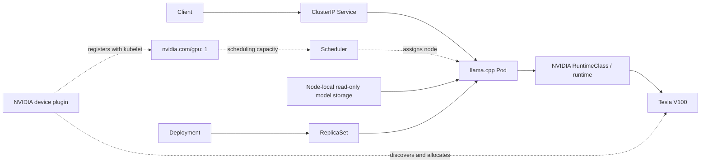

# V100 Kubernetes Inference

A bounded engineering project deploying a real llama.cpp CUDA inference workload on a single NVIDIA Tesla V100 using K3s. It demonstrates explicit GPU scheduling, traceable application provenance, startup/readiness handling, controlled benchmarking and desired-state recovery. These are hands-on development observations, with no production Kubernetes tenure or production-readiness claim.

## Key results

The inference configuration uses native **multi-token prediction (MTP) speculative decoding, n=2**.

### Docker vs Kubernetes

| Same CUDA MTP n=2 workload | Mean decode tokens/sec |
| --- | ---: |
| Docker | **58.244** |
| K3s | **58.268** |

Signed difference: **+0.0417%**, using the phase report's rounded Docker baseline.

> No material inference-throughput penalty from Kubernetes was observed in this controlled three-run experiment.

This does not establish that Kubernetes universally has zero overhead.

### MTP application result

Controlled same-image Docker comparison: target-only **26.852 decode tokens/sec**, native MTP n=2 **58.244 decode tokens/sec**, improvement **+116.9%**. Generated output was byte-identical in the controlled test. This is application optimisation, not Kubernetes optimisation.

### Recovery result

After deliberate deletion of the real inference Pod:

| Milestone from deletion request | Seconds |
| --- | ---: |
| Replacement Pod creation observed | **0.234** |
| Scheduler assignment | **0.758** |
| Container start | **1.569** |
| Model loaded | **6.699** |
| Pod Ready observed | **7.100** |
| Service HTTP 200 response | **7.193** |
| Successful small inference response | **7.513** |

Kubernetes did not restart the deleted Pod. The Deployment's desired state caused a new Pod with a new identity to be created. Timings mix observed status delivery, runtime timestamps and client response completion; they are not a general recovery SLA.

## Hardware/software

Lenovo P520 workstation; Tesla V100 32 GB; Xeon W-2135; 128 GB-class RAM; Ubuntu 24.04; NVIDIA R580 driver (580.178.04); NVIDIA Container Toolkit 1.20.1; K3s v1.37.1+k3s1 / Kubernetes v1.37.1; NVIDIA device plugin v0.20.1; CUDA image components 12.8.1. The application is [anyei/llamacpp-v100](https://github.com/anyei/llamacpp-v100/tree/d6c02899a83c175fc3e56f3b07c6da0f4b6e5ee3), pinned to `d6c02899a83c175fc3e56f3b07c6da0f4b6e5ee3`.

## Architecture

Dashed arrows show resource discovery, allocation and scheduling. RuntimeClass selects the NVIDIA runtime handler, which makes the allocated GPU available to the container. The device plugin registers devices with kubelet and participates in allocation; it is separate from the runtime/device-access path. See [architecture](docs/architecture.md).

## Application configuration

The pinned V100 fork was built for CUDA sm70 and frozen as one immutable image/artifact for both runtimes. Qwen3.8-27B Q6_K_M (`Qwen3.8-27B-UD-Q6_K_M.gguf`), context 8192, one inference slot, flash attention, f16 K/V cache and native MTP n=2 were unchanged between Docker and K3s. Model weights and the private image archive are not distributed. [Provenance and reproduction details](docs/implementation-notes.md) distinguish recorded bytes from a fresh rebuild.

## GPU scheduling

K3s initially advertised no GPU. After NVIDIA runtime detection and registration by the official NVIDIA device plugin, Node Capacity/Allocatable became `nvidia.com/gpu: 1`. The inference Pod explicitly requests and limits one GPU using RuntimeClass `nvidia`; ordinary Pods continue with the normal runtime. The plugin was scoped to the V100 because the host also contained another NVIDIA GPU. V100 has no MIG.

## Startup/readiness

Model loading and initialisation took approximately five seconds. A startup probe permits legitimate initialisation; readiness prevents Service routing until `/health` succeeds. No liveness probe was added because no distinct permanent-hang failure mode had been established.

## Benchmark methodology

Exact same imported image bytes, model, arguments, request and MTP behaviour; temperature 0, fixed seed; one warm-up and three measured runs. Server-reported prefill/decode throughput is kept separate from client elapsed time. Kubernetes client elapsed includes a temporary loopback port-forward. See [methodology and per-run results](docs/benchmark-methodology.md).

## Recovery experiment

One ordinary Pod deletion preserved Deployment, ReplicaSet and Service identities. The replacement briefly waited for the sole GPU while the original terminated. Startup/readiness and EndpointSlice changes were observed independently of actual Service health and an eight-token inference. **Container running != Pod Ready != Service usable.** See [recovery experiment](docs/recovery-experiment.md).

## Reproducibility

Another engineer needs a Linux host, a GPU compatible with this sm70 configuration, NVIDIA driver/runtime, K3s with the NVIDIA runtime handler, a separately acquired matching model, and an image built from the pinned revision or their own explicitly identified equivalent. Edit the GPU UUID, generic node name and model directory examples before applying them. Follow the [reproduction procedure](docs/implementation-notes.md#reproduction-procedure); no private Docker archive is supplied and bit-identical fresh builds are not promised.

## Limitations

One physical node and one V100; no HA, multi-node scheduling or GPU sharing. Model storage is node-local `hostPath`. V100 has no MIG. Three short benchmark runs, one cached-artifact recovery, no soak test, no production uptime, production reliability qualification or production Kubernetes tenure claim. Native non-Kubernetes GPU workloads are invisible to Kubernetes GPU accounting. GPU Operator was deliberately not required for the bounded core experiment. See [limitations](docs/limitations.md).

## Future work

- GPU Operator
- GitOps
- CI/CD
- Observability
- GPU sharing/time slicing
- Multi-node inference

## Licence

Publicly inspectable **but not open-source licensed**. Original source and documentation may be cloned, built, run and modified locally for portfolio, recruitment and technical evaluation under [LICENSE](LICENSE). See [licence scope](LICENSE-STATUS.md) and [third-party notices](THIRD_PARTY_NOTICES.md).
